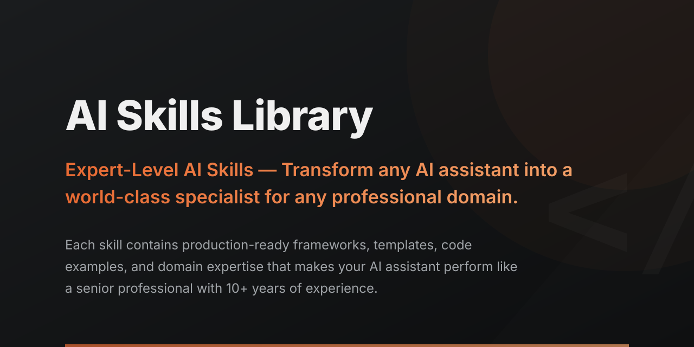

<p align="center">
  
</p>

<h1 align="center">Claude Skills</h1>
<p align="center"><b>AI skills for every team, not just engineering.</b></p>

<p align="center">
  
  
  
  
  
  
  <a href="LICENSE"></a>
</p>

---

## Try it now

**No setup, any AI chat.** Browse the [skill library](https://borghei.github.io/Claude-Skills), click **Try it now** on any skill, and paste the prompt into Claude.ai, ChatGPT, or Gemini.

**Save it to your AI.** Click **Save to my AI** to install as a Claude Project or Custom GPT. Guided setup, no terminal.

### Install in Claude Cowork (Claude desktop app)

In the Claude desktop app:

1. Open **Customize** (bottom-left)
2. Go to **Browse plugins**
3. Enter: `borghei/Claude-Skills`

All 368 skills become available across your Claude conversations.

<!-- TODO: add install GIF at .docs/images/claude-skills-install.gif — recording recipe in .docs/images/README.md -->


### For developers

```bash
npx @borghei/claude-skills add senior-fullstack
```

Auto-detects Claude Code, Cursor, Codex, Gemini CLI, Copilot, Windsurf, Cline, Aider, and Goose. Drops the skill into the right directory for your assistant. Node 18+, no Python required.

See [docs/INSTALLATION.md](docs/INSTALLATION.md) for the Claude Code plugin, MCP server, manual install, and CLI tooling.

---

## What you get

**Ship a SOC 2 audit. Run a sprint retro. Draft a board update. Spin up a fintech compliance program.** Real workflows you can finish today, not prompt templates that need a prompt engineer to drive them.

- **The only OSS skills library covering regulated industries.** SOC 2, ISO 13485, MDR, FDA, EU AI Act, NIS2, DORA, HIPAA, GDPR. 18 compliance frameworks with checklists, gap analyses, and audit-ready outputs.
- **Scripts that actually run, not just prompt templates.** 859 Python tools you can pipe into CI, MCP servers, or your own scripts. Standard library only, no pip cliffs.
- **Call one persona, get a stack of skills behind it.** `startup-cto`, `growth-marketer`, `solo-founder`, `cs-cto-advisor`, `cs-fintech-advisor`, and more. 76 expert identities ready out of the box.
- **Works with your AI assistant.** Claude Code, Cursor, Codex, Gemini CLI, Copilot, Windsurf, Cline, Aider, Goose, OpenCode, and ChatGPT / Claude.ai.
- **Discovery → delivery → career for product teams.** Project Management is the deepest domain — 68 skills, and every one ships with a worked example, an anti-pattern library, and a deterministic scoring rubric. 15 PM skills callable as MCP tools. 5 chain pipelines, 3 live data adapters. Jira / Linear / Notion / Productboard / Confluence. Tier 3 adds strategy frameworks (BMC, Lean Canvas, SWOT, Porter's, Ansoff) and GTM (gtm-strategy, ICP).
- **Runs the business, not just the codebase.** Business operations (capacity planning, process mapping, vendor and procurement management), applied research ops (market, product, clinical study design, research finance), and a stdlib-only markdown→HTML publishing pipeline with a CI-ready review gate.

*Supporting evidence:* 368 skills · 859 Python tools · 76 agents · 18 compliance frameworks · 20 domains · 11 platforms.

---

## Browse skills by domain

**[Project Management (68) ★](project-management/)** *(most-visited domain. Discovery, delivery, career growth, strategy frameworks, GTM, Jira / Linear / Notion / Confluence.)*

[Engineering (91)](engineering/) · [Marketing (39)](marketing/) · [C-Level (31)](c-level-advisor/) · [Compliance (27)](ra-qm-team/) · [Business & Growth (20)](business-growth/) · [Legal (17)](legal/) · [Product Team (13)](product-team/) · [Personal Productivity (13)](personal-productivity/) · [Vertical Advisors (7)](vertical-advisors/) · [Business Operations (6)](business-operations/) · [Data (6)](data-analytics/) · [Sales (5)](sales-success/) · [HR (4)](hr-operations/) · [Documents (4)](documents/) · [Research (4)](research/) · [Research Ops (4)](research-ops/) · [Markdown-HTML (4)](markdown-html/) · [Finance (3)](finance/) · [Workflow (2)](workflow/) · [All skills →](docs/SKILLS.md)

---

## How it works

### Pre-built expert identities

8 cross-domain personas that combine skills from multiple domains into a single expert:

`startup-cto` · `growth-marketer` · `solo-founder` · `content-strategist` · `devops-engineer` · `finance-lead` · `product-manager` · `skill-creator`

Activate with `/persona startup-cto` or just mention it in conversation. Add the 68 single-domain `cs-*` agents (e.g. `cs-cto-advisor`, `cs-fintech-advisor`, `cs-scrum-master`) for narrower expertise.

### Deep-dive skill packs

Three multi-skill packs go deeper on a single topic: **Playwright Pro** (browser automation, 8 sub-skills), **Self-Improving Agent** (agents that evaluate their own outputs, 6 sub-skills), and **AgentHub** (multi-agent orchestration, 7 sub-skills). See [standards/](standards/).

### Slash commands

26 commands for common workflows: `/tdd`, `/rice`, `/prd`, `/retro`, `/tech-debt`, `/security-scan`, `/sprint-plan`, `/changelog` and more. Run `/README` in Claude Code for the full list, or see [docs/commands/](docs/commands/).

### Ready-made kits by role

Pre-configured skill bundles for common roles:

`SaaS Founder Kit` · `DevOps Kit` · `Compliance Kit` · `Growth Kit` · `Product Kit` · `Data Kit` · `Security Kit` · `Finance Kit` · `PM Starter Pack` · `PM Career Track`

Install one bundle and the right set of skills lands in your project. See [bundles.json](bundles.json).

### Orchestration patterns

4 multi-agent patterns for complex workflows: sequential pipeline, parallel fan-out, supervisor delegation, and consensus voting. Defined in the [Orchestration Protocol standard](standards/).

---

## Works with your AI assistant

| Platform | Status |
|----------|--------|
| Claude Code | Native |
| OpenAI Codex | Native |
| Gemini CLI | Native |
| Cursor | Native |
| GitHub Copilot | Native |
| Windsurf | Native |
| Cline | Native |
| Goose | Native |
| Aider | Compatible |
| Jules | Compatible |
| RooCode | Compatible |

See [docs/INSTALLATION.md](docs/INSTALLATION.md) for per-platform setup.

---

## Documentation

- **Full docs site:** [borghei.github.io/Claude-Skills](https://borghei.github.io/Claude-Skills)
- **Skills reference:** [docs/SKILLS.md](docs/SKILLS.md)
- **Agents reference:** [docs/AGENTS.md](docs/AGENTS.md)
- **Usage guide:** [docs/USAGE.md](docs/USAGE.md)
- **Installation:** [docs/INSTALLATION.md](docs/INSTALLATION.md)
- **Contributing:** [CONTRIBUTING.md](CONTRIBUTING.md)
- **Standards:** [standards/](standards/)

---

## Contributing

Contributions welcome. See [CONTRIBUTING.md](CONTRIBUTING.md) for guidelines. Fork the repo, create a skill following the [Skill Authoring Standard](standards/), include Python tools and YAML frontmatter, and submit a PR.

---

## Contributors

| Contributor | GitHub |
|-------------|--------|
| Alan Pope | [@popey](https://github.com/popey) |
| Izzy | [@weemax](https://github.com/weemax) |
| Rohan (Tessl) | [@rohan-tessl](https://github.com/rohan-tessl) |

---

## Disclaimer

> **This project is built with the assistance of AI tools (Claude, GPT, etc.).** While every effort is made to ensure accuracy, AI-generated content (including skill definitions, reference guides, Python tools, frameworks, and documentation) may contain errors, inaccuracies, or outdated information. Always verify critical information independently before using it in production, compliance, legal, financial, or safety-critical contexts. The authors accept no liability for decisions made based on the content in this repository. Use at your own risk.

---

## License

**MIT + Commons Clause**. Free for open-source, personal, education, and internal business use. Cannot be sold or repackaged as a paid product. See [LICENSE](LICENSE) for full terms.

---

<p align="center">
  <strong>368 skills · 859 tools · 20 domains · 76 agents · 11 platforms.</strong><br>
  <a href="https://borghei.me">borghei.me</a>
</p>

<p align="center">
  <a href="https://buymeacoffee.com/borghei"></a>
</p>
