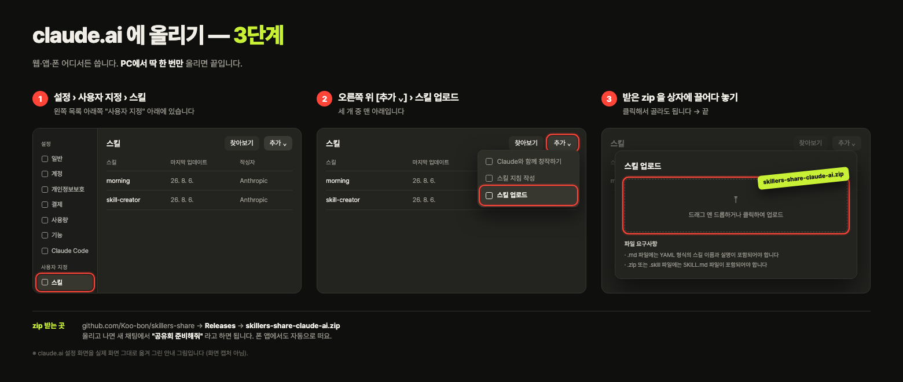

# 공유회-OS

**1시간짜리 발표를, 주제 정하기부터 발표 대본까지 만들어주는 클로드 스킬.**

### ⏱️ 30초 안내 — 나는 어디서 쓰지?

| 나는… | 설치 | 걸리는 시간 |
|---|---|---|
| **터미널(Claude Code)을 쓴다** | 링크 붙여넣고 "이거 설치해줘" | 10초 |
| **claude.ai 앱·웹만 쓴다** | 릴리스 zip 받아 **설정→스킬→업로드**에 드래그 | 30초(1회) |

> ❓ **"앱인데 왜 그냥 링크로 안 깔려요?"** — claude.ai는 커스텀 스킬을 **업로드로만** 설치해요(채팅에 링크 붙여 설치하는 기능이 아직 없음). 대신 **한 번만** 올리면 같은 계정의 **웹·데스크톱 앱·폰 전부**에 떠요.
> 📱 **폰만 있어요?** — 업로드(드래그)는 **PC/데스크톱 앱에서 한 번** 하는 걸 권합니다. 그 뒤엔 폰 앱에서도 자동으로 `공유회 준비해줘`로 떠요.
>
> 💡 어디서 쓰든 **결과물(제목·목차·덱·발표 대본) 품질은 같아요.** 터미널에서만 되는 건 딱 둘 — 대화 기록 **자동 스캔**과 **인터넷 링크 자동 배포**. 앱에선 주제만 알려주면 되고, 덱은 HTML 파일로 나와요.

질문 3개에 답하면 이게 나옵니다.

| | |
|---|---|
| **제목** | 사람이 모이는 제목으로 |
| **목차** | 1시간 시간 배분 + 슬라이드 25~35장 |
| **발표 자료** | 어디서든 열리는 웹 슬라이드. 발표자 노트(`S`)·구간 타이머(`T`) 내장 |
| **발표 대본** | 오프닝 대사 · 데모 체크리스트 · 예상 질문과 답 |
| **인터넷 주소** | `deploy.sh` 한 줄이면 링크가 나옵니다 |

**주제가 막막해도 됩니다.** 대화 기록을 훑어 발표거리 후보를 먼저 깔아줍니다.

**PPT처럼 보이면 실패로 봅니다.** 제목+불릿 나열, 가운데 놓인 작은 이미지, 그라데이션, 클립아트, 시스템 기본 폰트를 쓰지 않습니다. 표지는 내지와 다른 규칙으로 만듭니다 — 한 장으로 발표를 파는 포스터니까요.

> 스폰지클럽 스킬러스 유닛에서 쓰려고 만들었지만, **1시간 발표를 준비하는 사람이면 누구나** 쓸 수 있습니다.

## 설치

### 먼저 확인하세요

맥은 `git` 빼고 전부 기본 설치돼 있습니다. 터미널을 열고 아래를 붙여넣어 확인하세요.

```bash
for c in git curl tar python3; do command -v $c >/dev/null && echo "OK  $c" || echo "없음 $c"; done
```

- `git` 이 없으면 → 맥에서는 `xcode-select --install` 로 설치됩니다 (몇 분 걸립니다)
- 나머지가 없으면 → 흔한 경우가 아닙니다. 채널에 물어보세요
- **터미널을 처음 여신다면** → `Command + 스페이스` 누르고 `터미널` 입력

### 설치 — 셋 중 편한 걸로

**① 제일 쉬움 — Claude Code에 링크 붙여넣고 "이거 설치해줘"**
터미널의 Claude Code(또는 클로드 데스크톱 앱의 Code)에 아래 한 줄을 붙여넣고 "이거 설치해줘" 하면, 클로드가 알아서 받아서 깔아줍니다.
```
https://github.com/Koo-bon/skillers-share
```

**② 한 줄 명령 (클로드 없이)**
```bash
curl -fsSL https://raw.githubusercontent.com/Koo-bon/skillers-share/main/install.sh | bash
```

**③ 직접 clone**
```bash
git clone https://github.com/Koo-bon/skillers-share.git
cd skillers-share && bash install.sh
```

`install.sh` 가 하는 일:
1. `공유회-OS` 를 `~/.claude/skills/` 에 복사
2. webdeck 덱 엔진 4개 파일을 `github.com/Koo-bon/webdeck` 에서 다운로드
3. 함께 쓰는 스킬 3종을 원본에서 최신으로 설치 (이미 있으면 건드리지 않음)

인터넷이 없으면 2번이 실패하고, 3번은 동봉본으로 진행됩니다.

### claude.ai 웹·데스크톱 앱·폰에서 쓰기 — 터미널 필요 없음

**미리 만들어 둔 zip을 받아서 올리기만** 하면 됩니다. 빌드도, 터미널도 필요 없어요.

1. **받기** → [최신 릴리스 zip 다운로드](https://github.com/Koo-bon/skillers-share/releases/latest/download/skillers-share-claude-ai.zip)
2. claude.ai → **설정 → 사용자 지정 → 스킬 → [추가 ▾] → 스킬 업로드**
3. 받은 zip을 **끌어다 놓기** → 끝. 같은 계정의 **웹·데스크톱 앱·폰 어디서나** `공유회 준비해줘` 로 뜹니다.



📱 **폰만 쓰는 분** — 이 업로드(드래그)는 **PC나 데스크톱 앱에서 한 번만** 하세요. 폰 브라우저에선 파일 드래그가 잘 안 될 수 있어요. 한 번 올려두면 폰 앱에도 자동으로 떠서, 그다음부턴 폰에서 `공유회 준비해줘` 만 하면 됩니다.

> claude.ai는 커스텀 스킬을 **업로드로만** 설치합니다(URL 자동설치가 없음). 그래서 "한 번 올리기"는 피할 수 없지만, 경로·형식 문제는 이 zip에 **미리 다 해결**돼 있어 드래그 한 번이면 됩니다.
> (직접 다시 빌드하려면: `bash make-cloud-package.sh` → `dist/skillers-share-claude-ai.zip`)

웹·앱에서 달라지는 건 딱 두 개고, **산출물 품질은 터미널과 같습니다**:

| | 터미널(Claude Code) | claude.ai 웹·앱·폰 |
|---|---|---|
| 대화 기록 자동 스캔 | ✅ | ➖ 주제를 직접 알려주면 됨 |
| 인터넷 링크 자동 배포 | ✅ | ➖ 덱이 HTML 파일로 나옴 |
| 제목·목차·덱 디자인·발표 대본·검수 | ✅ | ✅ **동일** |

## 함께 쓰는 스킬

`훅카피` · `크리틱디렉터` · `spec-guard` 도 `install.sh` 가 같이 설치한다. 따로 받을 필요가 없다.

- **항상 최신** — 설치할 때 원본 저장소에서 최신을 받아온다. 네트워크가 없으면 동봉된 `bundled/` 스냅샷으로 떨어진다
- **이미 있으면 건드리지 않는다** — 쓰던 스킬이 그대로 남는다

최신으로 올리고 싶으면:

```bash
bash install.sh --force
```

이때만 기존 것을 `이름.backup-날짜` 로 백업하고 교체한다.

원본: [webdeck](https://github.com/Koo-bon/webdeck) · [spec-guard](https://github.com/Koo-bon/spec-guard)

## 쓰는 법

클로드에 이렇게 말하면 됩니다.

```
공유회 준비해줘
```

만든 발표 자료를 인터넷 주소로 올리려면:

```bash
bash ~/.claude/skills/공유회-OS/engine/deploy.sh <덱폴더>
```

`gh`(깃허브 명령도구)가 없으면 스크립트가 설치법과 손으로 올리는 법을 알려주고 멈춥니다.

## 발표 중 단축키

| 키 | 기능 |
|---|---|
| `S` | 발표자 노트 열기·닫기 |
| `T` | 구간 타이머 켜기·끄기 |
| `Shift + R` | 타이머 리셋 |

타이머 구간 경계는 데모 유무에 따라 다릅니다 — 있으면 5·20·35·50분, 없으면 5·20·30·45분.

## 구조

```
SKILL.md              오케스트레이터 — 8단계 흐름
references/
  interview.md        질문 3개와 스캔 규칙
  types.md            공유회 유형 6종
  titles.md           제목 패턴과 훅카피 브리프
  timeline.md         1시간 배분
  script.md           발표 스크립트 지침
  themes.md           디자인 테마 5종 + 폰트·타이포 + PPT 티 금지 + 표지 규칙
engine/
  share-extend.css    발표자 노트 · 타이머 · 테마 폰트/타이포
  share-extend.js
  (webdeck 덱 엔진은 install.sh 가 내려받는다)
bundled/              동봉 스킬 — 훅카피 · 크리틱디렉터 · spec-guard
install.sh            설치
verify.sh             번들 구조 검증
```

## 개발

```bash
bash verify.sh
```

## 라이선스

MIT. 마음대로 쓰고 고치고 배포하셔도 됩니다.

## 이어서 개발하려면

`docs/이어가기.md` 를 읽으세요. 지금 상태와 남은 할 일이 적혀 있습니다.
